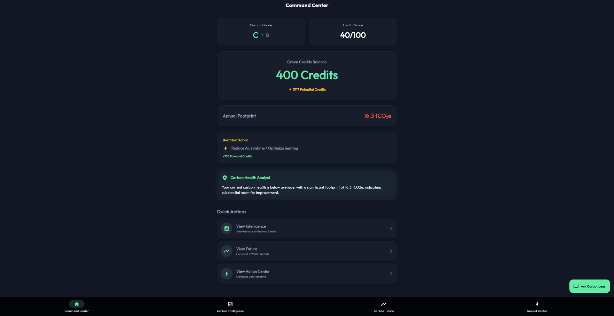
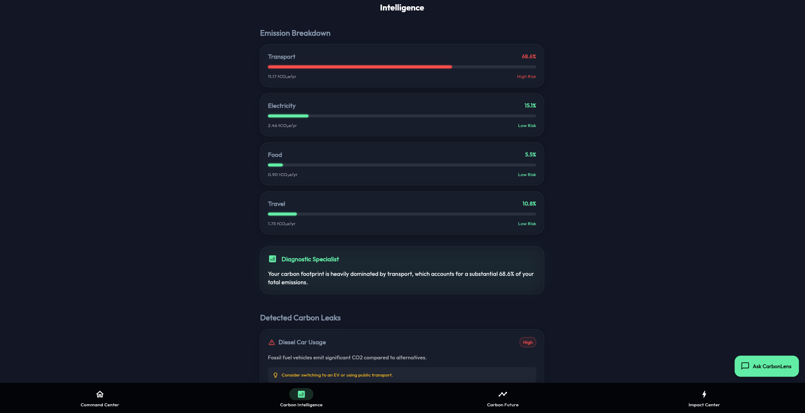
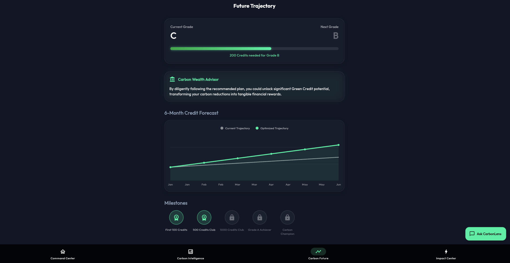
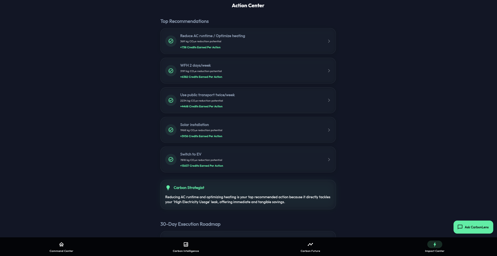
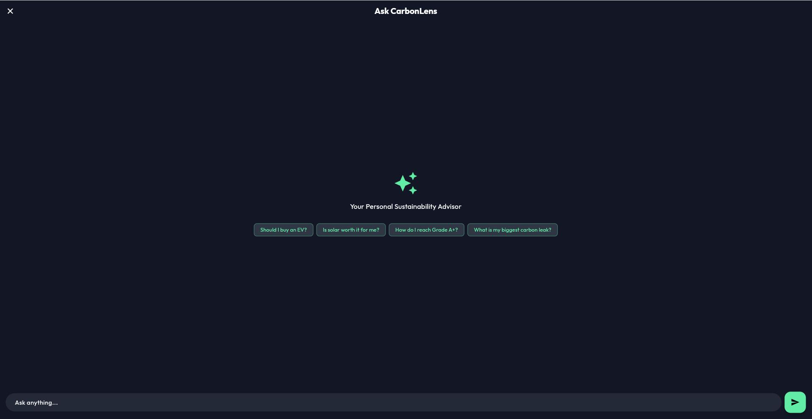
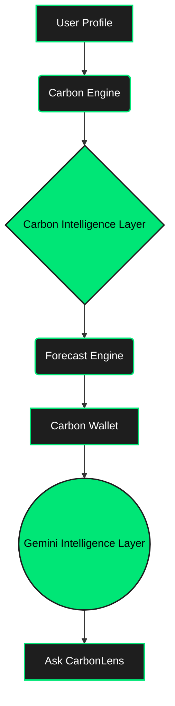

# 🌍 CarbonLens AI

## Personal Carbon Intelligence Platform

**Detect. Predict. Earn.**

CarbonLens AI helps individuals understand, forecast, and improve their environmental impact through Carbon Intelligence, Carbon Credits, and AI-powered decision support.

Unlike traditional carbon calculators that only estimate emissions, CarbonLens AI acts as a personal sustainability advisor that helps users identify hidden carbon leaks, predict future impact, earn carbon credits, and make smarter lifestyle decisions.

---

## Challenge

Many people want to live more sustainably but struggle to answer questions such as:

* What activities contribute most to my carbon footprint?
* Which lifestyle changes will create the biggest impact?
* How will my environmental impact evolve over time?
* Which actions are worth prioritizing?
* How can I track meaningful progress?

Most existing tools stop at reporting emissions.

CarbonLens AI focuses on helping users understand, predict, and act.

---

## Solution

CarbonLens AI is a Personal Carbon Intelligence Platform built around three principles:

### 🔍 Detect

Identify hidden carbon leaks and major emission sources.

### 🔮 Predict

Forecast future emissions, sustainability grades, and carbon credit growth.

### 🏆 Earn

Track Carbon Credits generated through sustainable behavior and recommended actions.

---

## Key Features

### 🏠 Carbon Command Center

Provides a complete overview of:

* Carbon Health Score
* Carbon Grade
* Carbon Credits
* Annual Footprint
* Potential Reduction Opportunities
* AI Insights

### 🧠 Carbon Intelligence

Combines:

* Carbon MRI Analysis
* Emission Breakdown
* Carbon Leak Radar
* Root Cause Detection

Users can understand where emissions originate and which areas require attention.

### 🔮 Carbon Future

Forecasts:

* Future Emissions
* Carbon Grade Progression
* Carbon Credit Growth
* Sustainability Milestones

Allows users to visualize long-term impact before making decisions.

### ⚡ Action Center

Provides:

* Ranked Sustainability Actions
* Impact Optimization
* Personalized 30-Day Transformation Plan
* Expected Reduction Outcomes

Helps users focus on the highest-value actions first.

### 💬 Ask CarbonLens

AI-powered sustainability advisor.

Users can ask:

* Should I buy an EV?
* Is solar worth it for me?
* How do I reach Grade A+?
* What is my biggest carbon leak?
* How can I earn more carbon credits?

Responses are generated using the user's profile, forecast, credits, and sustainability insights.

---

## Screenshots

*(Note: Replace these placeholder paths with actual screenshots of your application before submitting)*

 

 

 

 

 

---

## How It Works

### Step 1: User Profile

Users provide:

* Household information
* Electricity usage
* Commute distance
* Vehicle type
* Food preferences
* Travel habits

### Step 2: Carbon Engine

The Carbon Engine calculates:

* Carbon Footprint
* Carbon Score
* Carbon Grade
* Carbon Credits
* Emission Breakdown

### Step 3: Carbon Intelligence

The system identifies:

* Major emission contributors
* Carbon leaks
* Improvement opportunities

### Step 4: Future Forecast

The Forecast Engine projects:

* Future emissions
* Future carbon grades
* Potential carbon credit growth

### Step 5: AI Decision Support

Gemini-powered intelligence provides:

* Personalized insights
* Decision guidance
* Sustainability coaching
* Scenario analysis

---

## Architecture

## Technology Stack

### Frontend

* Flutter Web

### Backend

* FastAPI

### AI

* Google Gemini

### Deployment

* Railway

---

## Security

* Gemini API key stored only on backend
* Environment-based configuration
* Input validation
* Secure API communication
* No hardcoded secrets

---

## Testing

Automated tests cover:

* Carbon calculations
* Grade calculations
* Carbon credits
* Forecast generation
* Recommendation ranking
* Error handling
* Gemini fallback logic

---

## Accessibility

CarbonLens AI includes:

* Semantic labels
* Screen reader support
* Keyboard navigation
* High contrast design
* Responsive layouts

---

## Assumptions

Carbon footprint estimates are intended for awareness and decision support purposes.

Carbon Credits in CarbonLens are personal sustainability reward units representing estimated emissions avoided and are not tradable market carbon credits.

---

## Future Enhancements

* Smart meter integrations
* Real-time carbon tracking
* Community challenges
* Carbon credit marketplace integrations
* Sustainability goal tracking

---

## Live Demo

[https://carbonlens-ai-production-2936.up.railway.app](https://carbonlens-ai-production-2936.up.railway.app)

---

## Repository

[https://github.com/Rathieshr/CarbonLens-Ai.git](https://github.com/Rathieshr/CarbonLens-Ai.git)

---

## Built For

PromptWars Challenge 3

**Theme:**
Helping individuals understand, track, and reduce their carbon footprint through simple actions and personalized insights.
